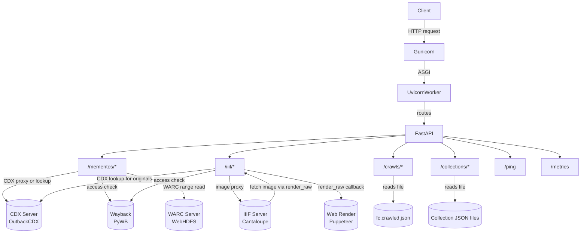

# 03 — Runtime Flow

## Starting the Application

### Development

```bash
pip install -r requirements.txt
uvicorn ukwa_api.main:app --reload
```

The app reloads on file changes. No `SCRIPT_NAME` prefix is set, so the API is served at the root (`/`).

### Production (Docker)

The Dockerfile CMD runs:

```bash
gunicorn -k ukwa_api.worker.UkwaApiWorker ukwa_api.main:app \
  --bind 0.0.0.0:8000 --workers ${WORKERS} \
  --forwarded-allow-ips '*' --log-level ${LOG_LEVEL} --access-logfile -
```

Gunicorn spawns multiple processes, each running a Uvicorn ASGI worker (`ukwa_api.worker.UkwaApiWorker`).  
The worker sets `root_path` to `SCRIPT_NAME` so FastAPI knows it's mounted at a URL prefix.

## Application Initialisation

When `ukwa_api/main.py` is imported:

1. **Environment is read**: `API_VERSION` and `SCRIPT_NAME` are pulled from env vars.
2. **FastAPI app is created** with a global `get_db` dependency (SQLAlchemy session).
3. **Static files** are mounted at `/static`.
4. **Prometheus instrumentation** is wired in and exposed at `/metrics`.
5. **OpenAPI schema** is customised with UKWA branding, contact info, and the `servers` URL set to `SCRIPT_NAME`.
6. **CORS middleware** is added allowing all origins, methods, and headers.
7. **Routers are registered**:
   - `mementos` at `/mementos`
   - `iiif` at `/iiif`
   - `crawls` at `/crawls`
   - `collections` at `/collections`
8. A `/ping` health-check endpoint is registered.

The **nominations router is commented out** and does not load at runtime.

## External Service Wiring

The application does not connect to external services at startup.  
All connections to CDX, Wayback, WARC server, the rendering service, and the IIIF server are made **per-request**, resolved from environment variables at module load time.

The IIIF module initialises a **filesystem cache** (`cachelib.FileSystemCache`) at startup for screenshot caching.

## Request Lifecycle

For most requests the flow is:

1. Request arrives at Gunicorn → dispatched to a Uvicorn worker.
2. FastAPI routes the request to the appropriate router function.
3. If the endpoint touches WARC or IIIF content, `can_access` is called first — a synchronous HTTP call to Wayback that gates access.
4. The handler calls the relevant external service (CDX, WARC server, rendering service, or IIIF server).
5. Responses are streamed or returned directly to the caller.

## Runtime Flow Diagram



## Differences Between Modes

| Aspect | Development | Production (Docker) |
|---|---|---|
| Server | `uvicorn --reload` | Gunicorn + multiple UvicornWorkers |
| `SCRIPT_NAME` | `""` (root) | `/api` |
| CDX server | Configurable via env | `http://cdx.api.wa.bl.uk/data-heritrix` (default) |
| Wayback server | `http://pywb:8080/test/` (compose) | `https://www.webarchive.org.uk/wayback/archive/` |
| Prometheus | Single process | Multi-process via `PROMETHEUS_MULTIPROC_DIR` |
| Screenshot cache | Local filesystem | Local filesystem (container-local) |
| Crawl stats | `test/data/fc.crawled.json` | Configured via `ANALYSIS_SOURCE_FILE` |
| Collections | `test/data/collections/` | Configured via `JSON_DIR` |
