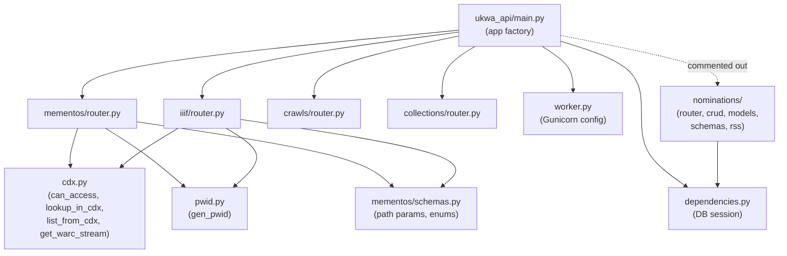
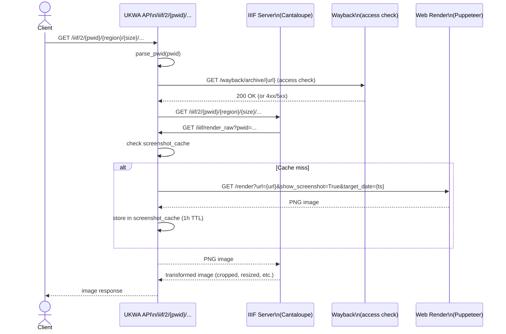

# 08 — Diagrams

## 1. Runtime Flow

```mermaid
flowchart TD
    Client([Client])
    Gunicorn[Gunicorn]
    UW[UkwaApiWorker\nUvicorn ASGI]
    FastAPI[FastAPI App\nukwa_api/main.py]

    subgraph Routers
        M[/mementos]
        I[/iiif]
        C[/crawls]
        Co[/collections]
    end

    subgraph External Services
        CDX[(CDX Server\nOutbackCDX)]
        WB[(Wayback\nPyWB)]
        WS[(WARC Server\nWebHDFS)]
        WR[(Web Render\nPuppeteer)]
        IIIF[(IIIF Server\nCantaloupe)]
    end

    subgraph Disk
        CJ[fc.crawled.json]
        CL[collections/*.json]
        SC[screenshot_cache/]
    end

    Client --> Gunicorn --> UW --> FastAPI
    FastAPI --> M & I & C & Co

    M -->|access check| WB
    M -->|CDX query or proxy| CDX
    M -->|WARC byte-range| WS

    I -->|access check| WB
    I -->|image proxy| IIIF
    IIIF -->|render_raw callback| I
    I -->|render screenshot| WR
    I <-->|cache read/write| SC

    C --> CJ
    Co --> CL
```

---

## 2. Module Interaction Diagram



---

## 3. IIIF Screenshot Request — Sequence Diagram


